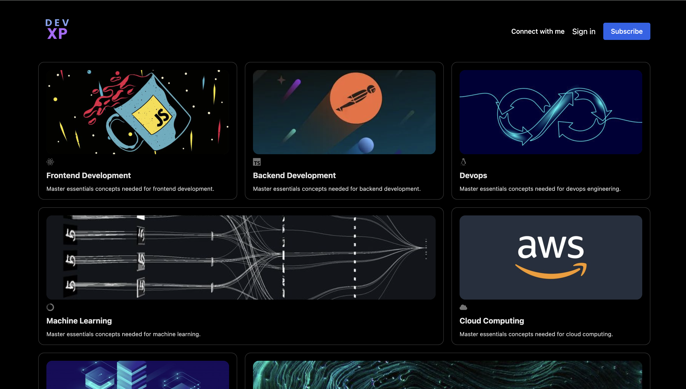

# 🏄‍♂️ Siddhant Gupta

**`Fullstack Developer`**

Hi, I'm a full-stack developer building my version of the digital world one step at a time. All coding projects are built from the ground up, from planning and designing all the way to solving real-life problems with code. Even though I am more backend oriented, I thrive on delivering exceptional end-user experiences.

<h3>👨‍💻 Sid's Coding Journey</h3>

 

---

I began my coding journey as an eager computer science student with an insatiable passion to dive deep into the world of programming—code, UNIX, Linux, and theory. Alongside my coursework, I self-taught Machine Learning, dreaming of building my own ML model. However, that dream took a backseat as I became captivated by Fullstack Development, a passion that led to a Data Engineering role upon graduation.  

In 2024, I started with frontend development but quickly found myself drawn toward the intricacies of Backend Engineering. My learning philosophy was simple: embrace challenges, avoid tutorial traps, and push through obstacles by exploring and solving problems independently. This approach not only honed my skills but also fueled my love for creating and building incrementally.  

Eventually, I stepped away from the safety net of structured roles and ventured into the uncharted waters of solo development—conceiving, designing, and coding my ideas from scratch. It was exhilarating, and it worked out well. But over time, comfort crept in. Building for the sake of creation without solving meaningful problems felt easy.  

Now, I’m ready to embrace discomfort again. The fire within to build something impactful—a product younger me once dreamed of—burns brighter than ever. To realize this vision, I’m taking deliberate steps to refocus my time and energy on this goal, setting the stage for a breakthrough by year’s end.  

So, don’t wait up—because I’m on my way.  

---  

  
  
  
  
  
  
  
  

---
### 🧰 Languages and Tools

  
  
  
  
  
  
  
  
  
  
  
  
  
  
  
  
  
  
  
  
  
  
  
  
  
  
  
  
  
  
  
  
  
  
  
  
  
  
  
  
  
  
  
  
  
  
  
  
  
  
  
  
  
  
  
  
  
  
  
  
  
  
  
  
  
  
  
  
  
  
  

#

### 📺 Latest Projects 

##### DevXP - Newsletter for Techies

---

### 📊 Stats

  
  

---
<picture>
  <source media="(prefers-color-scheme: dark)" srcset="https://raw.githubusercontent.com/sidhnxtt/sidhnxtt/output/github-snake-dark.svg" />
  <source media="(prefers-color-scheme: light)" srcset="https://raw.githubusercontent.com/sidhnxtt/sidhnxtt/output/github-snake.svg" />
  
</picture>