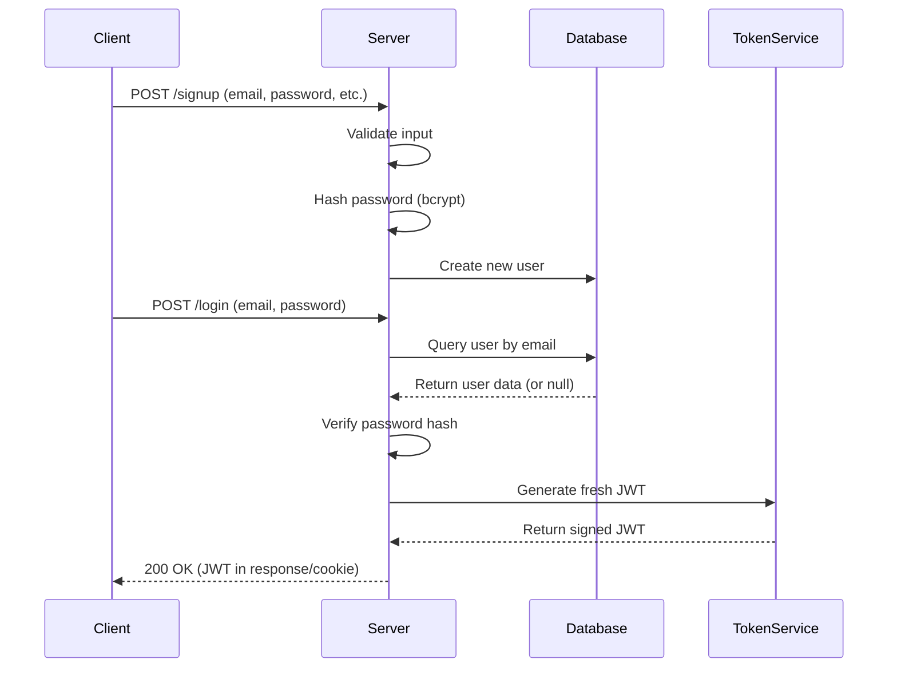
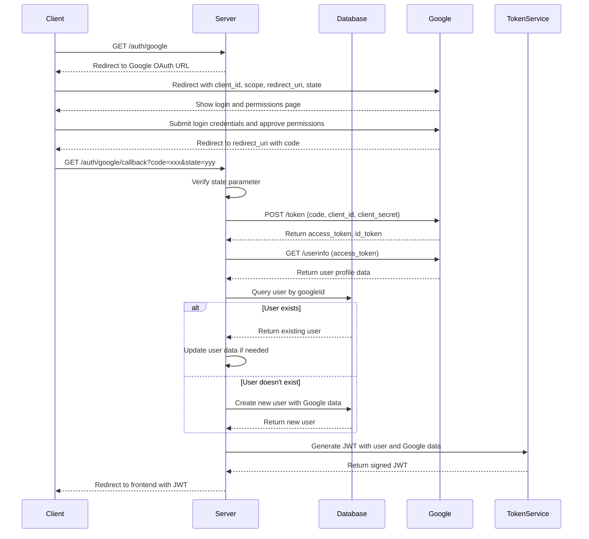
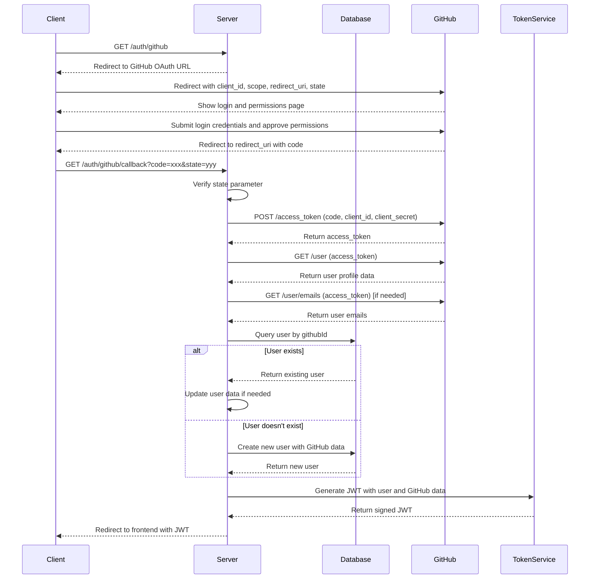
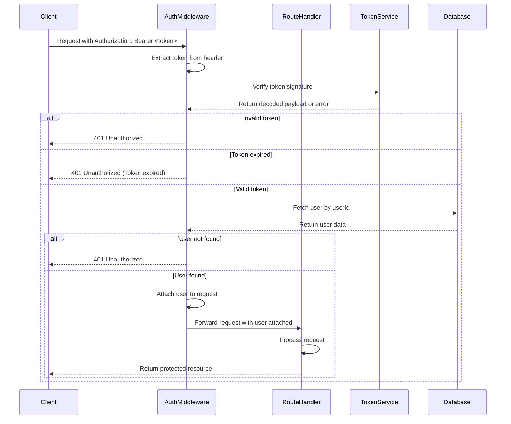
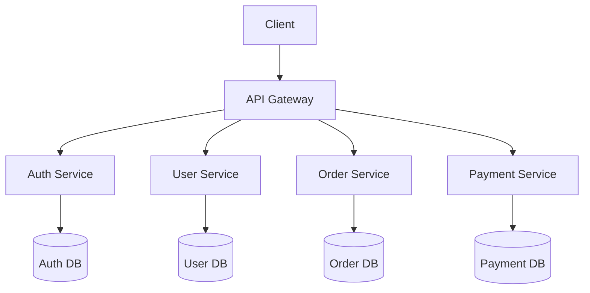

# The Ultimate Guide to Authentication: OAuth, JWT, and Dynamic Payloads

## Introduction

Authentication is a critical component of modern web applications, ensuring that users are who they claim to be before granting access to protected resources. This comprehensive guide explores the intricacies of different authentication methods and how they can be unified through JWT (JSON Web Token) with dynamic payloads.

## 1. Understanding Authentication Flows in Detail

### Local Authentication Flow (Email & Password)

Traditional authentication relies on users providing their email and password directly to your application.

**Detailed Flow:**

1. **User Registration (Signup):**
   - User submits email, password, and potentially other required fields
   - Server validates the input (checks password strength, email format, etc.)
   - Server hashes the password using a secure algorithm (e.g., bcrypt with appropriate salt rounds)
   - Server stores user details in the database.

2. **User Login:**
   - User submits email and password
   - Server retrieves the user record from the database
   - Server compares the submitted password with the stored hash
   - If valid, server generates a fresh JWT with user-specific claims
   - Server sends the JWT back to the client

**JWT Payload Example:**
```json
{
  "userId": "a1b2c3d4e5f6",
  "email": "user@example.com",
  "role": "user",
  "permissions": ["read", "write"],
  "iat": 1613385600,
  "exp": 1613389200
}
```

**Security Considerations:**
- Password must be stored as hashes (never plaintext)
- Implement rate limiting to prevent brute force attacks
- Enforce strong password policies
- Consider implementing two-factor authentication (2FA)

### Google OAuth Flow

Google OAuth allows users to authenticate using their Google accounts, eliminating the need to remember another set of credentials.

**Detailed Flow:**

1. **Initialization:**
   - User clicks "Sign in with Google" button
   - Application redirects to Google's OAuth server with specific parameters:
     - Client ID (obtained when registering your app with Google)
     - Redirect URI (where Google will send the user after authentication)
     - Scope (what user information your app is requesting)
     - State (random string to prevent CSRF attacks)

2. **Google Authentication:**
   - User logs into their Google account if not already logged in
   - Google displays permissions screen showing what data your app is requesting
   - User grants or denies permission

3. **Callback Handling:**
   - Google redirects back to your application's redirect URI with an authorization code
   - Your server exchanges this code for an access token by making a server-to-server request to Google
   - Your server uses the access token to request the user's profile information from Google

4. **User Creation/Retrieval:**
   - Server checks if a user with the given Google ID exists in your database
   - If not, it creates a new user record with the Google profile information
   - If yes, it updates the existing user record if necessary

5. **JWT Generation:**
   - Server creates a JWT containing user information and Google-specific details
   - Server sends the JWT back to the client

**JWT Payload Example:**
```json
{
  "userId": "g7h8i9j0k1l2",
  "email": "user@gmail.com",
  "googleId": "109876543210987654321",
  "name": "John Doe",
  "picture": "https://lh3.googleusercontent.com/photo.jpg",
  "role": "user",
  "iat": 1613385600,
  "exp": 1613389200
}
```

**Security Considerations:**
- Validate the token on the server side
- Implement proper state parameter handling to prevent CSRF
- Store Google tokens securely
- Handle token expiration and refresh appropriately

### GitHub OAuth Flow

GitHub OAuth is particularly useful for developer-focused applications, allowing users to authenticate with their GitHub accounts.

**Detailed Flow:**

1. **Initialization:**
   - User clicks "Sign in with GitHub" button
   - Application redirects to GitHub's OAuth server with specific parameters:
     - Client ID (obtained when registering your app with GitHub)
     - Redirect URI
     - Scope (e.g., user:email, read:user)
     - State parameter (for CSRF protection)

2. **GitHub Authentication:**
   - User logs into GitHub if not already logged in
   - GitHub shows permissions screen detailing what access your app is requesting
   - User approves or denies the request

3. **Callback Handling:**
   - GitHub redirects back to your application's redirect URI with an authorization code
   - Your server exchanges this code for an access token via a POST request to GitHub
   - Your server uses the access token to fetch the user's profile information

4. **User Creation/Retrieval:**
   - Server checks if a user with the given GitHub ID exists in your database
   - If not, it creates a new user record with the GitHub profile information
   - If yes, it updates the existing user record if necessary

5. **JWT Generation:**
   - Server creates a JWT containing user information and GitHub-specific details
   - Server sends the JWT back to the client

**JWT Payload Example:**
```json
{
  "userId": "m3n4o5p6q7r8",
  "email": "dev@github.com",
  "githubId": "12345678",
  "login": "devuser",
  "name": "Developer User",
  "avatar_url": "https://avatars.githubusercontent.com/u/12345678",
  "role": "developer",
  "iat": 1613385600,
  "exp": 1613389200
}
```

**Security Considerations:**
- Validate tokens on the server side
- Use the state parameter properly
- Request only the minimum required scopes
- Handle API rate limits appropriately

## 2. Detailed Visualization of Authentication Flows

### Local Authentication Flow - Detailed Sequence



### Google OAuth Flow - Detailed Sequence



### GitHub OAuth Flow - Detailed Sequence



## 3. Accessing Protected Routes with JWT Tokens - Detailed Flow

Once a user has authenticated, they use their JWT to access protected resources.

### Detailed JWT Verification Process



### Important Considerations for Protected Routes

1. **Token Extraction:**
   - Extract the JWT from the Authorization header (Bearer token)
   - Alternatively, extract from cookies or query parameters (less secure)

2. **Token Verification:**
   - Verify the token's signature using the secret key
   - Check if the token has expired
   - Validate required claims (issuer, audience, etc.)

3. **User Retrieval:**
   - Extract the user ID from the verified token
   - Fetch the user from the database to ensure they still exist and are active
   - This step is optional but recommended for critical operations

4. **Permission Checking:**
   - Examine the user's role and permissions in the token
   - Determine if the user has access to the requested resource
   - Implement role-based access control (RBAC) if needed

5. **Request Processing:**
   - If all checks pass, process the request
   - Return the protected resource to the client

6. **Error Handling:**
   - Return appropriate HTTP status codes for different errors:
     - 401 Unauthorized: Invalid or expired token
     - 403 Forbidden: Valid token but insufficient permissions
     - 404 Not Found: Resource doesn't exist
     - 500 Internal Server Error: Server-side issues

## 4. The Dynamic Nature of JWT Payloads - Detailed Examination

The JWT payload varies based on the authentication method, allowing for flexible and provider-specific information.

### Comprehensive JWT Payload Comparison

| Claim | Local Auth | Google OAuth | GitHub OAuth | Purpose |
|-------|------------|--------------|--------------|---------|
| `userId` | ✓ | ✓ | ✓ | Unique identifier in your system |
| `email` | ✓ | ✓ | ✓ | User's email address |
| `role` | ✓ | ✓ | ✓ | User's role in your system |
| `permissions` | ✓ | ✓ | ✓ | Array of user permissions |
| `localId` | ✓ | - | - | Local authentication identifier |
| `googleId` | - | ✓ | - | Google account identifier |
| `githubId` | - | - | ✓ | GitHub account identifier |
| `name` | ✓ | ✓ | ✓ | User's full name |
| `picture` | - | ✓ | - | Google profile picture URL |
| `avatar_url` | - | - | ✓ | GitHub avatar URL |
| `login` | - | - | ✓ | GitHub username |
| `iat` | ✓ | ✓ | ✓ | Issued at timestamp |
| `exp` | ✓ | ✓ | ✓ | Expiration timestamp |
| `iss` | ✓ | ✓ | ✓ | Issuer (your application) |
| `aud` | ✓ | ✓ | ✓ | Audience (your API) |

### JWT Payload Generation Logic

The server dynamically constructs the JWT payload based on:

1. **Base Claims:**
   - Standard claims like `iat`, `exp`, `iss`, `aud`
   - Core user information: `userId`, `email`, `role`, `permissions`

2. **Provider-Specific Claims:**
   - For local auth: Add `localId` if applicable
   - For Google auth: Add `googleId`, `picture`, etc.
   - For GitHub auth: Add `githubId`, `login`, `avatar_url`, etc.

```javascript
function generateJwtPayload(user, authType) {
  // Base claims
  const payload = {
    userId: user.id,
    email: user.email,
    role: user.role,
    permissions: user.permissions,
    iat: Math.floor(Date.now() / 1000),
    exp: Math.floor(Date.now() / 1000) + (60 * 60), // 1 hour
    iss: 'your-application-name',
    aud: 'your-api'
  };
  
  // Add provider-specific claims
  switch (authType) {
    case 'local':
      if (user.localId) payload.localId = user.localId;
      break;
    case 'google':
      if (user.googleId) payload.googleId = user.googleId;
      if (user.picture) payload.picture = user.picture;
      if (user.given_name) payload.given_name = user.given_name;
      if (user.family_name) payload.family_name = user.family_name;
      break;
    case 'github':
      if (user.githubId) payload.githubId = user.githubId;
      if (user.login) payload.login = user.login;
      if (user.avatar_url) payload.avatar_url = user.avatar_url;
      break;
  }
  
  return payload;
}
```

### Advanced JWT Strategies

1. **Nested Claims:**
   For complex applications, you might use nested objects to organize provider data:
   
   ```json
   {
     "userId": "a1b2c3",
     "providers": {
       "local": { "id": "local123" },
       "google": { "id": "google456", "picture": "..." },
       "github": { "id": "github789", "login": "..." }
     }
   }
   ```

2. **Linked Accounts:**
   For users who have linked multiple authentication methods:
   
   ```json
   {
     "userId": "a1b2c3",
     "primaryAuth": "google",
     "linkedAuth": ["local", "github"],
     "googleId": "109876543210987654321",
     "githubId": "12345678"
   }
   ```

3. **Scoped Tokens:**
   For applications with different access levels:
   
   ```json
   {
     "userId": "a1b2c3",
     "scope": "read:profile write:orders",
     "context": {
       "authMethod": "github",
       "authProviderId": "12345678"
     }
   }
   ```

## 5. Implementation Strategies

### Backend Implementation (Node.js/Express Example)

```javascript
const express = require('express');
const jwt = require('jsonwebtoken');
const bcrypt = require('bcrypt');
const passport = require('passport');
const GoogleStrategy = require('passport-google-oauth20').Strategy;
const GitHubStrategy = require('passport-github2').Strategy;
const LocalStrategy = require('passport-local').Strategy;

const app = express();
const JWT_SECRET = process.env.JWT_SECRET;

// Local Strategy Setup
passport.use(new LocalStrategy(
  { usernameField: 'email' },
  async (email, password, done) => {
    try {
      const user = await User.findOne({ email });
      if (!user) return done(null, false, { message: 'User not found' });
      
      const isMatch = await bcrypt.compare(password, user.password);
      if (!isMatch) return done(null, false, { message: 'Incorrect password' });
      
      return done(null, user);
    } catch (err) {
      return done(err);
    }
  }
));

// Google Strategy Setup
passport.use(new GoogleStrategy({
    clientID: process.env.GOOGLE_CLIENT_ID,
    clientSecret: process.env.GOOGLE_CLIENT_SECRET,
    callbackURL: "/auth/google/callback"
  },
  async (accessToken, refreshToken, profile, done) => {
    try {
      let user = await User.findOne({ googleId: profile.id });
      
      if (!user) {
        user = await User.create({
          googleId: profile.id,
          email: profile.emails[0].value,
          name: profile.displayName,
          picture: profile.photos[0].value
        });
      }
      
      return done(null, user);
    } catch (err) {
      return done(err);
    }
  }
));

// GitHub Strategy Setup
passport.use(new GitHubStrategy({
    clientID: process.env.GITHUB_CLIENT_ID,
    clientSecret: process.env.GITHUB_CLIENT_SECRET,
    callbackURL: "/auth/github/callback",
    scope: ['user:email']
  },
  async (accessToken, refreshToken, profile, done) => {
    try {
      let user = await User.findOne({ githubId: profile.id });
      
      if (!user) {
        const emails = profile.emails || [];
        const primaryEmail = emails.length > 0 ? emails[0].value : null;
        
        user = await User.create({
          githubId: profile.id,
          email: primaryEmail,
          name: profile.displayName,
          login: profile.username,
          avatar_url: profile.photos[0].value
        });
      }
      
      return done(null, user);
    } catch (err) {
      return done(err);
    }
  }
));

// Generate JWT with dynamic payload
function generateToken(user, authType) {
  const payload = {
    userId: user._id,
    email: user.email,
    role: user.role || 'user'
  };
  
  // Add provider-specific fields
  switch (authType) {
    case 'local':
      // Add local-specific fields if needed
      break;
    case 'google':
      payload.googleId = user.googleId;
      payload.picture = user.picture;
      break;
    case 'github':
      payload.githubId = user.githubId;
      payload.login = user.login;
      payload.avatar_url = user.avatar_url;
      break;
  }
  
  return jwt.sign(payload, JWT_SECRET, { expiresIn: '1h' });
}

// Local auth routes
app.post('/signup', async (req, res) => {
  try {
    const { email, password, name } = req.body;
    
    // Check if user already exists
    const existingUser = await User.findOne({ email });
    if (existingUser) {
      return res.status(400).json({ message: 'User already exists' });
    }
    
    // Hash password
    const salt = await bcrypt.genSalt(10);
    const hashedPassword = await bcrypt.hash(password, salt);
    
    // Create new user
    const user = await User.create({
      email,
      password: hashedPassword,
      name
    });
    
    // Generate token
    const token = generateToken(user, 'local');
    
    res.status(201).json({ token });
  } catch (err) {
    res.status(500).json({ message: 'Server error' });
  }
});

app.post('/login', (req, res, next) => {
  passport.authenticate('local', { session: false }, (err, user, info) => {
    if (err) return next(err);
    if (!user) return res.status(400).json({ message: info.message });
    
    const token = generateToken(user, 'local');
    return res.json({ token });
  })(req, res, next);
});

// Google auth routes
app.get('/auth/google',
  passport.authenticate('google', { scope: ['profile', 'email'] })
);

app.get('/auth/google/callback',
  passport.authenticate('google', { session: false }),
  (req, res) => {
    const token = generateToken(req.user, 'google');
    res.redirect(`/auth-success?token=${token}`);
  }
);

// GitHub auth routes
app.get('/auth/github',
  passport.authenticate('github', { scope: ['user:email'] })
);

app.get('/auth/github/callback',
  passport.authenticate('github', { session: false }),
  (req, res) => {
    const token = generateToken(req.user, 'github');
    res.redirect(`/auth-success?token=${token}`);
  }
);

// Protected route example
app.get('/api/profile',
  passport.authenticate('jwt', { session: false }),
  (req, res) => {
    res.json({ user: req.user });
  }
);

// Start server
app.listen(3000, () => {
  console.log('Server running on port 3000');
});
```

### Frontend Implementation (React Example)

```jsx
import React, { useState, useEffect } from 'react';
import axios from 'axios';

function App() {
  const [user, setUser] = useState(null);
  const [loading, setLoading] = useState(true);
  
  useEffect(() => {
    // Check if token exists in localStorage or URL
    const token = localStorage.getItem('token') || new URLSearchParams(window.location.search).get('token');
    
    if (token) {
      // Save token to localStorage if it came from URL
      if (!localStorage.getItem('token')) {
        localStorage.setItem('token', token);
        // Clean URL by removing token parameter
        window.history.replaceState({}, document.title, '/');
      }
      
      // Set axios default header
      axios.defaults.headers.common['Authorization'] = `Bearer ${token}`;
      
      // Fetch user profile
      fetchUserProfile();
    } else {
      setLoading(false);
    }
  }, []);
  
  const fetchUserProfile = async () => {
    try {
      const response = await axios.get('/api/profile');
      setUser(response.data.user);
    } catch (error) {
      console.error('Failed to fetch user profile:', error);
      // Handle invalid token
      if (error.response && error.response.status === 401) {
        localStorage.removeItem('token');
        axios.defaults.headers.common['Authorization'] = null;
      }
    } finally {
      setLoading(false);
    }
  };
  
  const handleLogout = () => {
    localStorage.removeItem('token');
    axios.defaults.headers.common['Authorization'] = null;
    setUser(null);
  };
  
  if (loading) {
    return <div>Loading...</div>;
  }
  
  return (
    <div className="App">
      {user ? (
        <div>
          <h1>Welcome, {user.name}</h1>
          {user.picture && }
          {user.avatar_url && }
          <p>Email: {user.email}</p>
          {user.login && <p>GitHub Username: {user.login}</p>}
          <button onClick={handleLogout}>Logout</button>
        </div>
      ) : (
        <div>
          <h1>Please Sign In</h1>
          <div>
            <a href="/auth/google">Sign in with Google</a>
          </div>
          <div>
            <a href="/auth/github">Sign in with GitHub</a>
          </div>
          <div>
            <form onSubmit={handleLocalLogin}>
              {/* Local login form */}
              <button type="submit">Sign in with Email</button>
            </form>
          </div>
        </div>
      )}
    </div>
  );
}

export default App;
```

## 6. Security Best Practices

### 1. JWT Security Considerations

- **Use HTTPS:** Always use HTTPS to prevent token interception
- **Set Appropriate Expiration:** Short-lived tokens (e.g., 15-60 minutes) minimize damage if compromised
- **Implement Token Rotation:** Refresh tokens when appropriate
- **Store Securely:** Use HttpOnly cookies or secure local storage
- **Validate on Server:** Always verify tokens on the server side
- **Include Only Necessary Data:** Don't put sensitive information in the payload

### 2. Protection Against Common Attacks

- **CSRF Protection:** Implement proper CSRF protection even when using JWTs
- **XSS Prevention:** Sanitize input and use Content Security Policy (CSP)
- **Token Leakage:** Don't include tokens in URLs or log them
- **Rate Limiting:** Implement rate limiting on authentication endpoints
- **Brute Force Protection:** Lock accounts after multiple failed attempts

### 3. Session Management

- **Forced Logout:** Implement a mechanism to invalidate tokens when needed
- **Token Blacklisting:** Consider using Redis to track invalidated tokens
- **Audit Logging:** Log authentication events for security analysis
- **Multiple Devices:** Handle multiple active sessions if needed

## 7. Implementing Token Invalidation

While JWTs are stateless by design, there are cases where you need to invalidate tokens before they expire:

### Using Redis for Token Blacklisting

```javascript
const redis = require('redis');
const redisClient = redis.createClient();

// Blacklist a token
async function blacklistToken(token, exp) {
  const decoded = jwt.decode(token);
  const ttl = decoded.exp - Math.floor(Date.now() / 1000);
  
  if (ttl > 0) {
    await redisClient.setEx(`blacklist:${token}`, ttl, 'true');
  }
}

// Middleware to check if token is blacklisted
async function checkTokenBlacklist(req, res, next) {
  const token = extractTokenFromHeader(req);
  
  if (!token) {
    return next();
  }
  
  const isBlacklisted = await redisClient.get(`blacklist:${token}`);
  
  if (isBlacklisted) {
    return res.status(401).json({ message: 'Token has been revoked' });
  }
  
  next();
}

// Add this middleware before your JWT authentication middleware
app.use(checkTokenBlacklist);
```

### Using a Version-Based Approach

Another approach is to include a "token version" in both the user record and the JWT:

```javascript
// Include token version in payload
function generateToken(user, authType) {
  const payload = {
    userId: user._id,
    tokenVersion: user.tokenVersion || 0,
    // ... other claims
  };
  
  return jwt.sign(payload, JWT_SECRET, { expiresIn: '1h' });
}

// Check token version during verification
async function verifyToken(req, res, next) {
  try {
    const token = extractTokenFromHeader(req);
    const decoded = jwt.verify(token, JWT_SECRET);
    
    // Fetch user from database
    const user = await User.findById(decoded.userId);
    
    // Check if token version matches
    if (user.tokenVersion !== decoded.tokenVersion) {
      return res.status(401).json({ message: 'Token has been revoked' });
    }
    
    req.user = user;
    next();
  } catch (err) {
    return res.status(401).json({ message: 'Invalid token' });
  }
}
```

To invalidate all tokens for a user, simply increment their `tokenVersion` in the database.

## 8. Scaling Authentication

For larger applications, consider these scaling strategies:

### 1. Microservices Architecture



In this architecture:
- The Auth Service handles all authentication logic
- The API Gateway verifies tokens for all incoming requests
- Each service can still verify tokens independently if needed

### 2. Distributed JWT Signing

For high availability:
- Use asymmetric encryption (RS256 instead of HS256)
- Deploy multiple authentication servers
- Share the public key with all services for verification
- Keep the private key secure on auth servers

### 3. Rate Limiting and Caching

- Implement rate limiting on authentication endpoints
- Cache frequently used user data
- Consider using a distributed cache like Redis

## Conclusion

A well-designed authentication system that supports multiple providers while maintaining a consistent JWT-based approach provides numerous benefits:

1. **Unified User Experience:** Users can choose their preferred login method
2. **Flexibility:** Easy to add new authentication providers
3. **Scalability:** The system can grow with your application
4. **Security:** Proper implementation reduces security risks
5. **Maintainability:** Consistent approach simplifies code maintenance

By understanding the intricacies of different authentication flows and how they can be unified through JWT with dynamic payloads, you can build a robust, secure, and user-friendly authentication system for your application.

### Next Steps

1. **Implement Token Refresh:** Add refresh token functionality for longer sessions
2. **Add Multi-Factor Authentication:** Enhance security with 2FA
3. **Monitor and Audit:** Implement logging and monitoring for security events
4. **Regular Security Reviews:** Periodically review and update your authentication system
5. **User Account Management:** Implement features like password reset, account linking, etc.